#  `Linux`网络编程## 网络模型
`OSI`七层网络模型
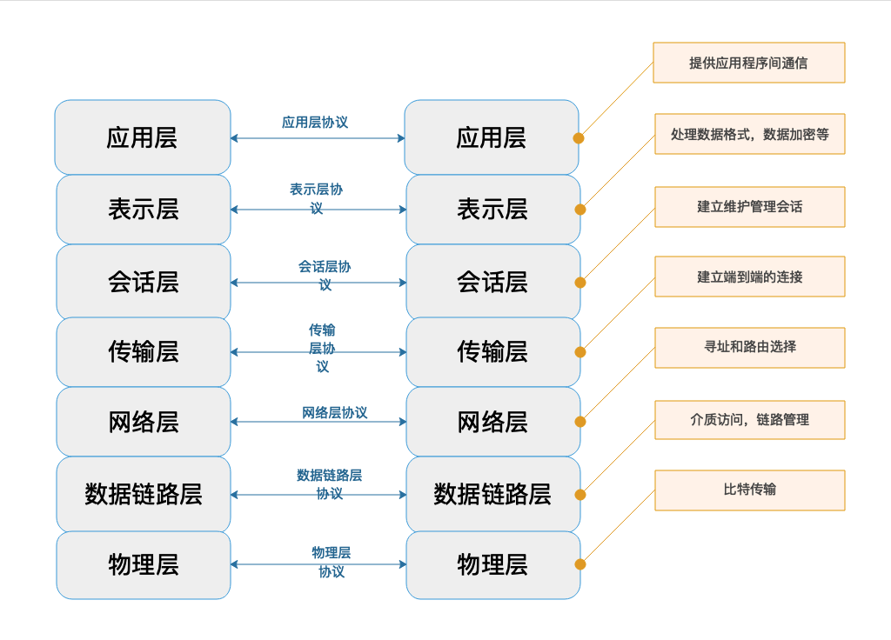
`TCPIP`网络模型:
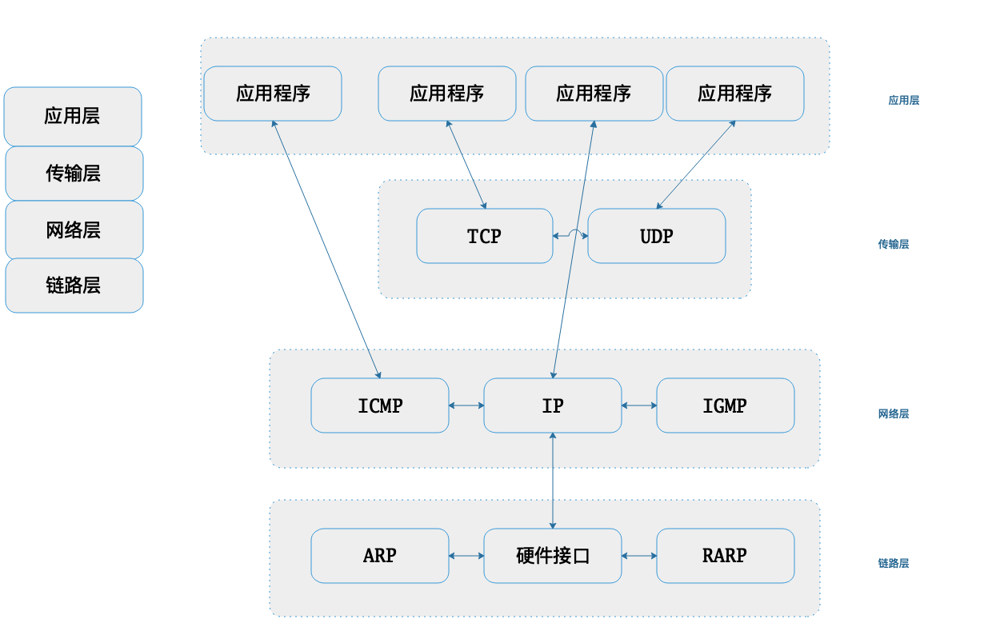
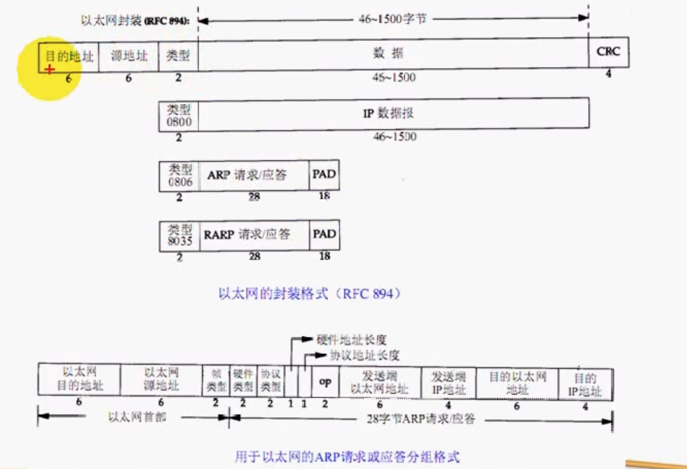
`ICMP`协议用于传递差错信息、时间、回显、网络信息等控制数据。
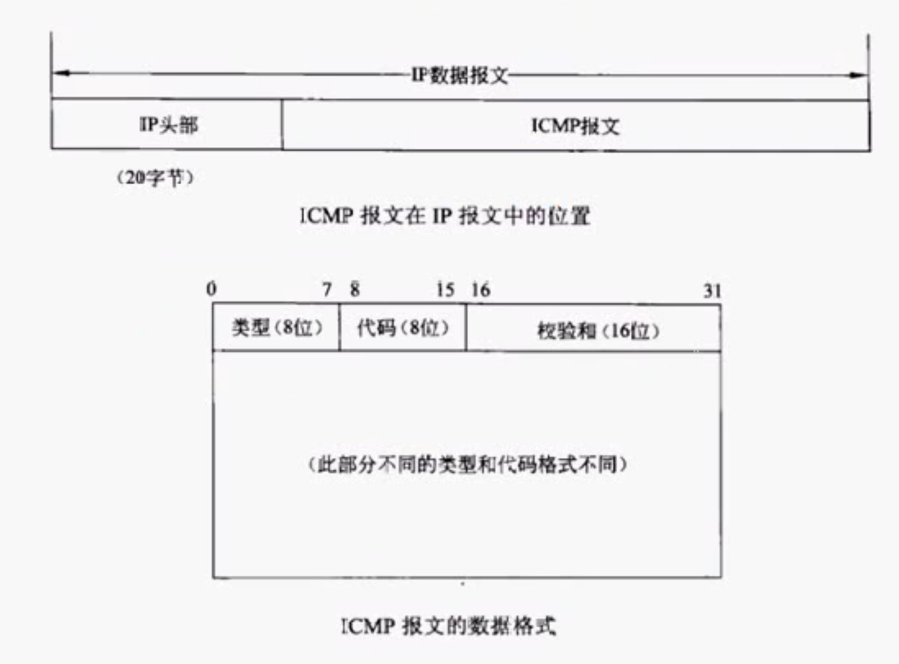
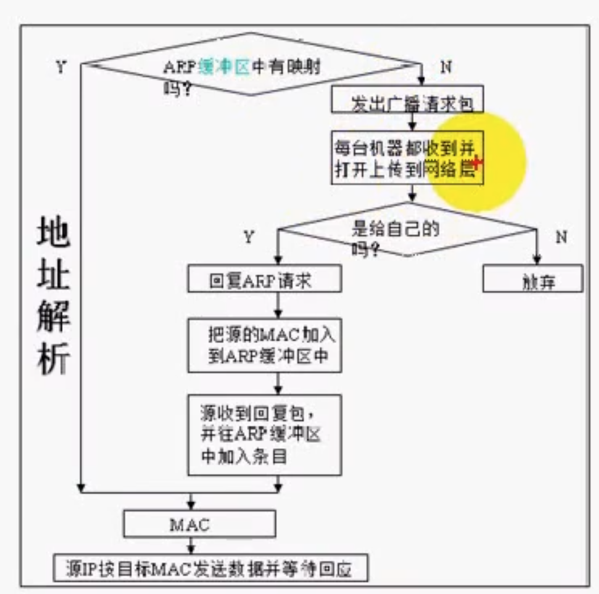
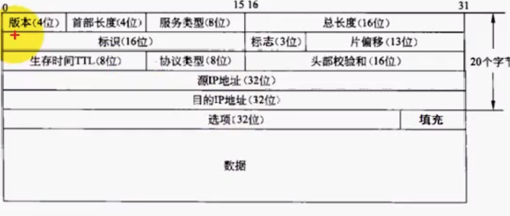
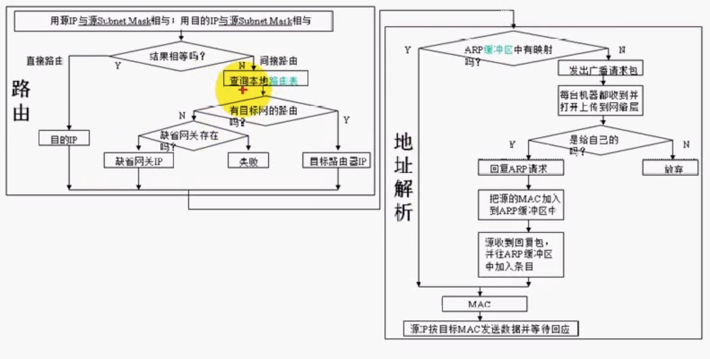
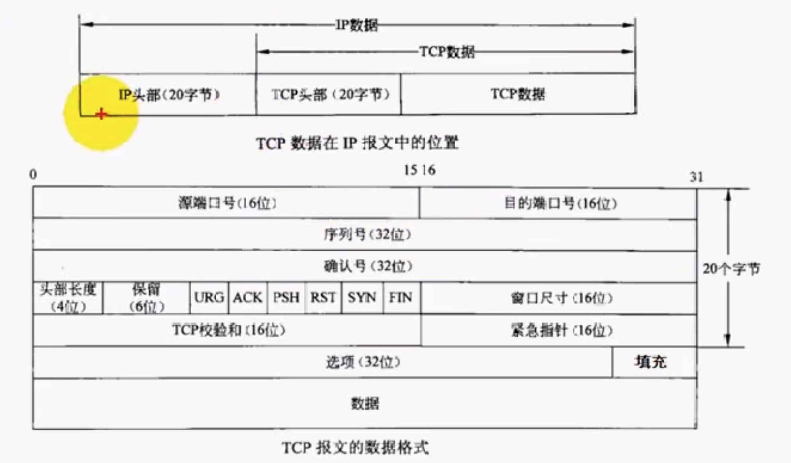
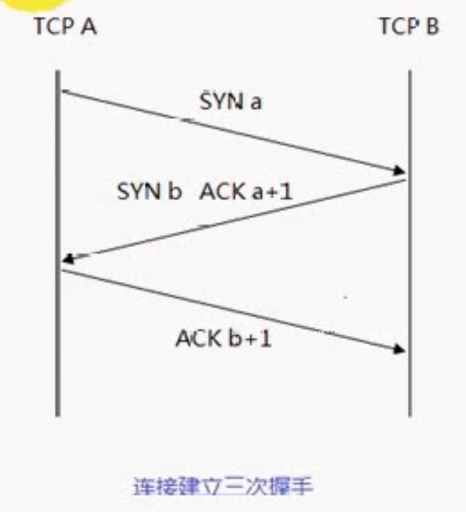
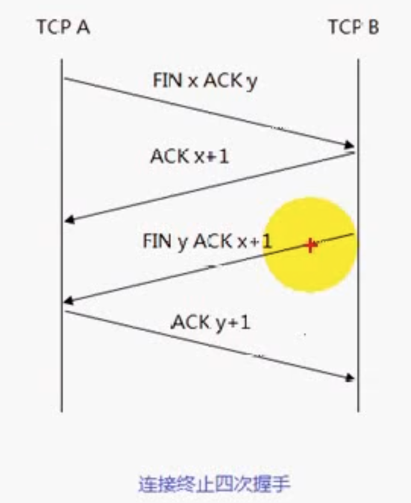
`TCP`可靠性保证：
1. 应用数据被分割成`TCP`认为最适合的段传递给`IP`层；
2. `TCP`发送一个报文之后，启动一个定时器，等待目的端确认收到这个报文段，如果不能及时收到这个确认，将重发这个报文段；
3. 当`TCP`收到发自另一个`TCP`端的数据时，将发送一个确认。这个确认延迟几分之一秒发送；
4. `TCP`将保持它的首部和数据的检验和，如果检验和不对丢弃数据不发送确认；
5. `TCP`对收到的报文重新排序；
6. `IP`报文段可能重复，`TCP`具有报文段去重的能力；
7. `TCP`提供报文控制，每个`TCP`连接端都提供一个缓冲区。

滑动窗口协议：
1. 通过接收窗口(`rwnd`): 预防应用程序发送的数据超过对方的缓冲区，接收方使用流量控制；
2. 拥塞窗口(`cwnd`)：预防发送的数据超过网络的承载能力，发送方流量控制；
3. 发送窗口取两者较小值；
4. 慢启动阈值(`ssthresh: slow start threshold`)
5. 慢启动阶段： `cwnd`从`1`增长到`ssthresh`；
6. 拥塞避免阶段： `cwnd`线性增长直至拥塞，将`cwnd=1, ssthresh减半`。

`UDP`特点：
无连接，不可靠，更加高效。
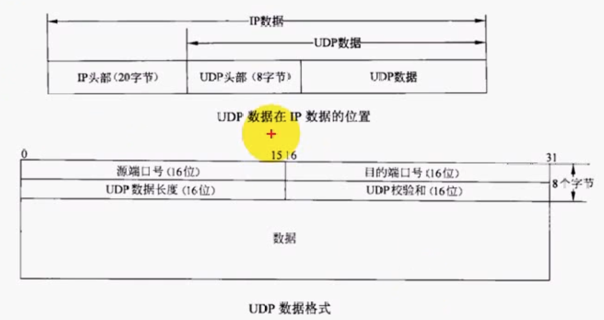
### `scoket`
`socket`可看做用户进程与内核网络协议栈的编程接口。
不仅可以在本机通信，也可以在不同主机的进程间通信。
通用地址结构：
```cpp
strcut sockaddr_in{
  uint8_t sin_len;
  sa_family_t sin_famliy;
  char sa_data[14];
};
```

网络字节序为大端字节序。
#### 套接字类型
1. 流式套接字(`SOCK_STREAM`): 面向连接的可靠的数据连接服务，数据无差错，无重复发送，且按顺序接收；
2. 数据报式套接字(`SOCK_DGRAM`)：无连接服务，可靠性无保证。
3. 原始套接字(`SOCK_RAW`)

`echo server`:
```cpp
/**
 * @file echosrv.cc
 * @author koritafei (koritafei@gmail.com)
 * @brief
 * @version 0.1
 * @date 2021-09-02
 *
 * @copyright Copyright (c) 2021
 *
 */

#include <arpa/inet.h>
#include <asm-generic/socket.h>
#include <bits/types/error_t.h>
#include <errno.h>
#include <netinet/in.h>
#include <stdio.h>
#include <stdlib.h>
#include <string.h>
#include <sys/socket.h>
#include <sys/types.h>
#include <unistd.h>

#include <cstdlib>

#define ERR_EXIT(m)                                                            \
  do {                                                                         \
    perror(m);                                                                 \
    exit(EXIT_FAILURE);                                                        \
  } while (0)

void do_service(int conn) {
  char buf[1024];
  for (;;) {
    memset(buf, 0, 1024);
    int ret = read(conn, buf, 1024);
    if (0 == ret) {
      printf("client close\n");
      break;
    }
    fputs(buf, stdout);
    write(conn, buf, ret);
  }
}

int main(int argc, char **argv) {
  int listenfd;
  if (0 > (listenfd = socket(PF_INET, SOCK_STREAM, IPPROTO_TCP))) {
    ERR_EXIT("socket error");
  }

  struct sockaddr_in servaddr;
  memset(&servaddr, 0, sizeof(servaddr));
  servaddr.sin_family      = AF_INET;
  servaddr.sin_port        = htons(8899);
  servaddr.sin_addr.s_addr = htonl(INADDR_ANY);

  int on = 1;

  if (0 > setsockopt(listenfd, SOL_SOCKET, SO_REUSEADDR, &on, sizeof(on))) {
    ERR_EXIT("setsockopt error");
  }

  if (0 > bind(listenfd,
               reinterpret_cast<struct sockaddr *>(&servaddr),
               sizeof(servaddr))) {
    ERR_EXIT("bind error");
  }

  if (0 > listen(listenfd, SOMAXCONN)) {
    ERR_EXIT("listen error");
  }

  struct sockaddr_in peeraddr;
  socklen_t          addrlen = sizeof(peeraddr);
  int                conn;

  pid_t pid;

  for (;;) {
    if (0 > (conn = accept(listenfd,
                           reinterpret_cast<struct sockaddr *>(&peeraddr),
                           &addrlen))) {
      ERR_EXIT("accept error");
    }

    printf("ip = %s, port = %d connect\n",
           inet_ntoa(peeraddr.sin_addr),
           ntohs(peeraddr.sin_port));
    pid = fork();
    if (-1 == pid) {
      ERR_EXIT("fork error");
    }

    if (0 == pid) {
      close(listenfd);
      do_service(conn);
      exit(EXIT_SUCCESS);
    } else {
      close(conn);
    }
  }

  close(conn);
  close(listenfd);

  return 0;
}
```
`echo client`:
```cpp
/**
 * @file echocli.cc
 * @author koritafei (koritafei@gmail.com)
 * @brief
 * @version 0.1
 * @date 2021-09-02
 *
 * @copyright Copyright (c) 2021
 *
 */

#include <arpa/inet.h>
#include <asm-generic/socket.h>
#include <bits/types/error_t.h>
#include <errno.h>
#include <netinet/in.h>
#include <stdio.h>
#include <stdlib.h>
#include <string.h>
#include <sys/socket.h>
#include <sys/types.h>
#include <unistd.h>

#define ERR_EXIT(m)                                                            \
  do {                                                                         \
    perror(m);                                                                 \
    exit(EXIT_FAILURE);                                                        \
  } while (0)

int main(int argc, char **argv) {
  int listenfd;

  if (0 > (listenfd = socket(PF_INET, SOCK_STREAM, IPPROTO_TCP))) {
    ERR_EXIT("socket error");
  }

  struct sockaddr_in servaddr;
  memset(&servaddr, 0, sizeof(servaddr));

  servaddr.sin_family      = AF_INET;
  servaddr.sin_port        = ntohs(8899);
  servaddr.sin_addr.s_addr = inet_addr("127.0.0.1");

  if (-1 == connect(listenfd,
                    reinterpret_cast<struct sockaddr *>(&servaddr),
                    sizeof(servaddr))) {
    ERR_EXIT("connect error");
  }

  char buf[1024];
  for (;;) {
    memset(buf, 0, 1024);
    if (NULL != fgets(buf, 1024, stdin)) {
      write(listenfd, buf, strlen(buf));
    }

    if (0 != read(listenfd, buf, 1024)) {
      printf("%s", buf);
    } else {
      printf("server close\n");
      break;
    }
  }

  close(listenfd);

  return 0;
}
```
多进程聊天：
`server`:
```cpp
/**
 * @file peerserv.cc
 * @author koritafei (koritafei@gmail.com)
 * @brief
 * @version 0.1
 * @date 2021-09-02
 *
 * @copyright Copyright (c) 2021
 *
 */

#include <arpa/inet.h>
#include <errno.h>
#include <netinet/in.h>
#include <signal.h>
#include <stdio.h>
#include <stdlib.h>
#include <string.h>
#include <sys/socket.h>
#include <sys/types.h>
#include <unistd.h>

#include <cstdlib>

#define MAXLINE 1024
#define ERR_EXIT(m)                                                            \
  do {                                                                         \
    perror(m);                                                                 \
    exit(EXIT_FAILURE);                                                        \
  } while (0)

void handler(int sig) {
  printf("recv a sig = %d\n", sig);
  exit(EXIT_SUCCESS);
}

int main(int argc, char **argv) {
  int sockfd;
  if (0 > (sockfd = socket(PF_INET, SOCK_STREAM, IPPROTO_TCP))) {
    ERR_EXIT("socket error");
  }

  struct sockaddr_in servaddr;
  memset(&servaddr, 0, sizeof(servaddr));
  servaddr.sin_family      = AF_INET;
  servaddr.sin_port        = htons(8899);
  servaddr.sin_addr.s_addr = htonl(INADDR_ANY);

  // bind
  if (0 > bind(sockfd,
               reinterpret_cast<struct sockaddr *>(&servaddr),
               sizeof(sockaddr))) {
    ERR_EXIT("bind error");
  }

  int on = 1;
  if (0 > setsockopt(sockfd, SOL_SOCKET, SO_REUSEADDR, &on, sizeof(on))) {
    ERR_EXIT("setsockopt error");
  }

  // listen
  if (0 > listen(sockfd, SOMAXCONN)) {
    ERR_EXIT("listen error");
  }

  // accept
  int                conn;
  struct sockaddr_in peeraddr;
  socklen_t          peerlen = sizeof(peeraddr);

  if (0 > (conn = accept(sockfd,
                         reinterpret_cast<struct sockaddr *>(&peeraddr),
                         &peerlen))) {
    ERR_EXIT("accept error");
  }

  printf("connenct ip = %s, port = %d\n",
         inet_ntoa(peeraddr.sin_addr),
         ntohs(peeraddr.sin_port));
  pid_t pid = fork();
  if (-1 == pid) {
    ERR_EXIT("fork error");
  }

  if (0 == pid) {
    signal(SIGUSR1, handler);
    char sendbuf[1024] = {0};
    while (fgets(sendbuf, sizeof(sendbuf), stdin) != NULL) {
      int ret = write(conn, sendbuf, strlen(sendbuf));
      if (ret == 0) {
        printf("peer close\n");
        close(sockfd);
        break;
      }
      if (0 > ret) {
        printf("peer close\n");
        close(sockfd);
        break;
      }
      memset(sendbuf, 0, MAXLINE);
    }
    exit(EXIT_SUCCESS);
  } else {
    // 父进程获取数据
    char buf[MAXLINE];
    for (;;) {
      memset(buf, 0, MAXLINE);
      int ret = read(conn, buf, MAXLINE);
      if (ret == 0) {
        printf("client close\n");
        close(conn);
        close(sockfd);
        kill(pid, SIGUSR1);
        break;
      }
      if (-1 == ret) {
        close(conn);
        close(sockfd);
        kill(pid, SIGUSR1);
        ERR_EXIT("read error");
      }
      fputs(buf, stdout);
    }

    kill(pid, SIGUSR1);
    exit(EXIT_SUCCESS);
  }

  close(conn);
  close(sockfd);

  return 0;
}
```
`client`:
```cpp
/**
 * @file peerclient.cc
 * @author koritafei (koritafei@gmail.com)
 * @brief
 * @version 0.1
 * @date 2021-09-02
 *
 * @copyright Copyright (c) 2021
 *
 */

#include <arpa/inet.h>
#include <errno.h>
#include <netinet/in.h>
#include <stdio.h>
#include <stdlib.h>
#include <string.h>
#include <sys/socket.h>
#include <sys/types.h>
#include <unistd.h>

#include <csignal>

#define MAXLINE 1024

#define ERR_EXIT(m)                                                            \
  do {                                                                         \
    perror(m);                                                                 \
    exit(EXIT_FAILURE);                                                        \
  } while (0)

void handler(int sig) {
  printf("recv a sig = %d\n", sig);
  exit(EXIT_SUCCESS);
}

int main(int argc, char **argv) {
  int sockfd;

  if (0 > (sockfd = socket(PF_INET, SOCK_STREAM, IPPROTO_TCP))) {
    ERR_EXIT("socket error");
  }

  struct sockaddr_in servaddr;
  memset(&servaddr, 0, sizeof(servaddr));
  servaddr.sin_family      = AF_INET;
  servaddr.sin_port        = htons(8899);
  servaddr.sin_addr.s_addr = inet_addr("127.0.0.1");

  if (-1 == connect(sockfd,
                    reinterpret_cast<struct sockaddr *>(&servaddr),
                    sizeof(servaddr))) {
    ERR_EXIT("connect error");
  }

  pid_t pid = fork();
  if (-1 == pid) {
    ERR_EXIT("fork error");
  }

  if (0 == pid) {
    // 子进程接收数据
    char buf[MAXLINE];
    for (;;) {
      int ret = read(sockfd, buf, MAXLINE);
      if (0 < ret) {
        printf("%s", buf);
      }
      if (0 == ret) {
        kill(getppid(), SIGUSR1);
        close(sockfd);
        printf("server close\n");
        break;
      }
      if (0 > ret) {
        kill(getppid(), SIGUSR1);
        close(sockfd);
        ERR_EXIT("read error");
      }
      memset(buf, 0, MAXLINE);
    }
  } else {
    signal(SIGUSR1, handler);
    char buf[MAXLINE];
    for (;;) {
      memset(buf, 0, MAXLINE);
      if (NULL != fgets(buf, MAXLINE, stdin)) {
        int ret = write(sockfd, buf, strlen(buf));
        if (ret == 0) {
          printf("peer close\n");
          close(sockfd);
          break;
        }
        if (0 > ret) {
          printf("peer close\n");
          close(sockfd);
          break;
        }
      }
    }
  }

  return 0;
}
```
### 流协议与粘包
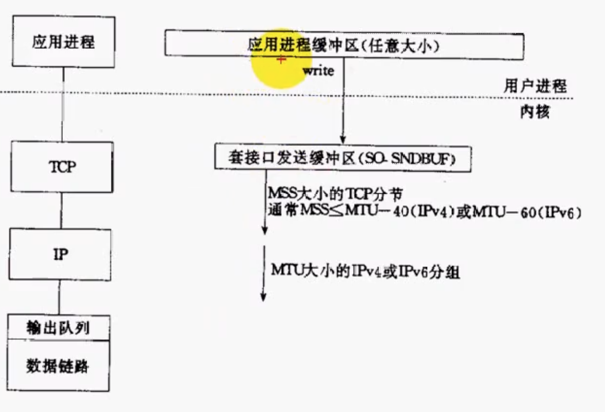
粘包的原因：
1. 出现粘包现象的原因是多方面的，它既可能由发送方造成，也可能由接收方造成。
2. 发送方引起的粘包是由TCP协议本身造成的，TCP为提高传输效率，发送方往往要收集到足够多的数据后才发送一包数据。若连续几次发送的数据都很少，通常TCP会根据优化算法把这些数据合成一包后一次发送出去，这样接收方就收到了粘包数据。
3. 接收方引起的粘包是由于接收方用户进程不及时接收数据，从而导致粘包现象。这是因为接收方先把收到的数据放在系统接收缓冲区，用户进程从该缓冲区取数据，若下一包数据到达时前一包数据尚未被用户进程取走，则下一包数据放到系统接收缓冲区时就接到前一包数据之后，而用户进程根据预先设定的缓冲区大小从系统接收缓冲区取数据，这样就一次取到了多包数据。

粘包解决方案：
1. 定长包；
2. 包尾增加`\r\n(ftp)`;
3. 包头增加包体长度；
4. 更复杂的应用层协议。
`recv`系统调用, 只能用于网络`IO`:
```cpp
#include <sys/socket.h>

ssize_t recv(int socket, void *buffer, size_t length, int flags);
ssize_t recvfrom(int socket, void *restrict buffer, size_t length, int flags, struct sockaddr *restrict address, socklen_t *restrict address_len);
ssize_t recvmsg(int socket, struct msghdr *message, int flags);
```
`TCP`状态：
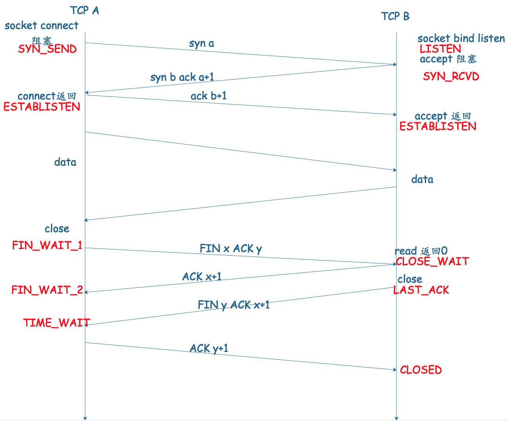
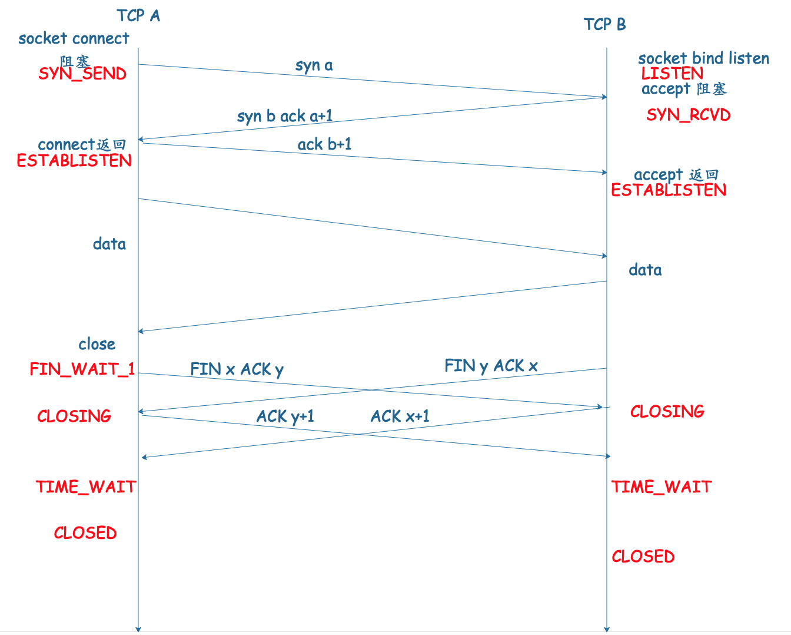
`TIME_WAIT`状态： 主动断开连接的一方存在。
#### `SIGPIPE`信号
1. 向一个已经接受了`FIN`的套接字中写是允许的，接收到`FIN`表示对方不再接收数据；
2. 如果接收到`RST`段后，如果再调用`write`就会产生`SIGPIPE`信号。处理方式：忽略(`signal(SIGPIPE, SIG_IGN)`).
### `I/O`模型
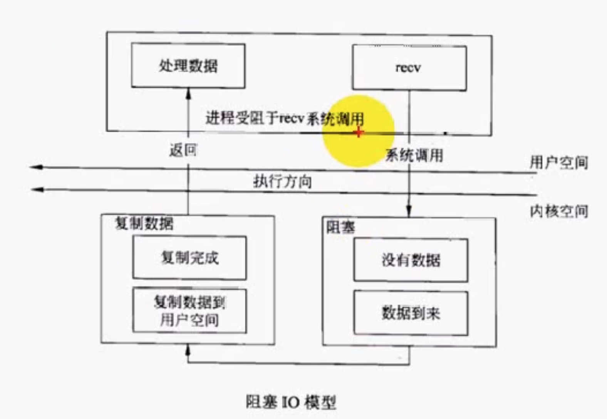
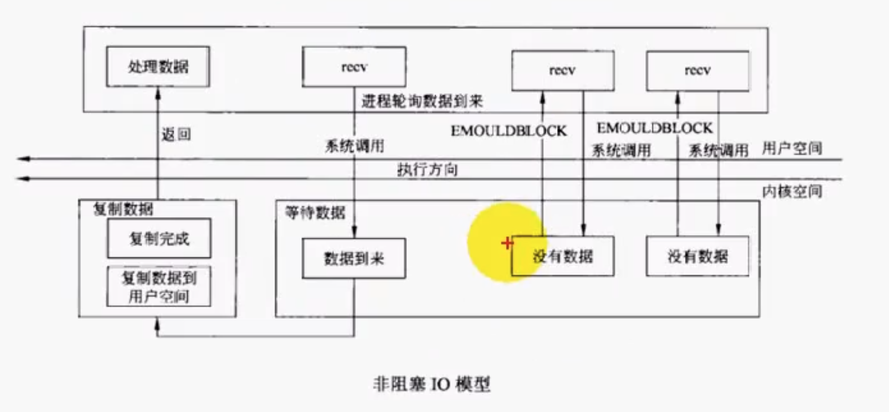
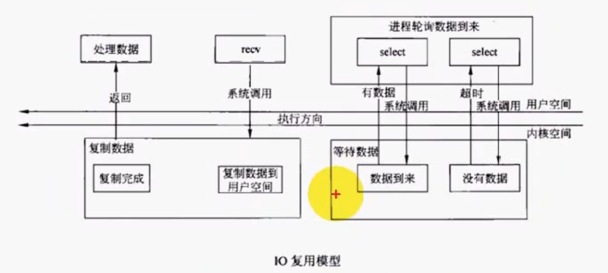
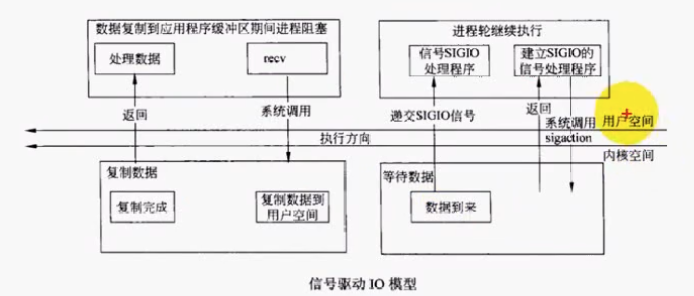
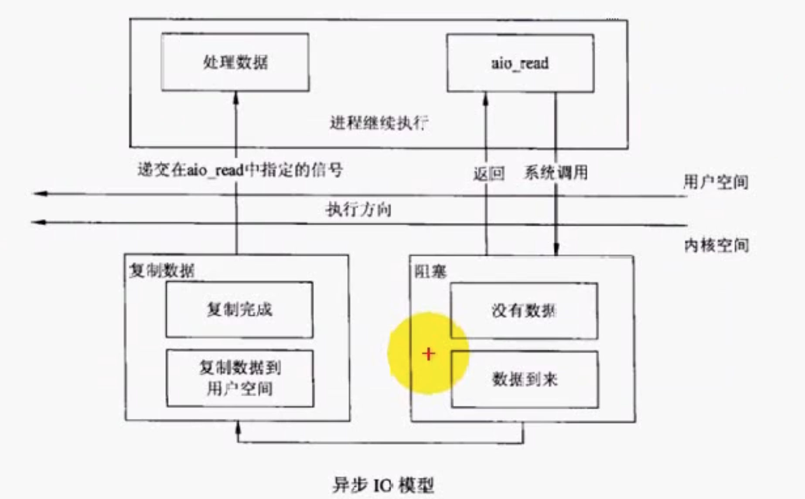
```cpp
#include <sys/select.h>

/**
 * @brief select IO多路复用
 *
 * @param __nfds
 * @param __readfds
 * @param __writefds
 * @param __exceptfds
 * @param __timeout
 * @return int
 */
int select(int __nfds,
           fd_set *__restrict __readfds,
           fd_set *__restrict __writefds,
           fd_set *__restrict __exceptfds,
           struct timeval *__restrict __timeout);
```
### 读，写，异常事件发生条件
1. 可读
   > * 套接口缓冲区有数据可读；
   > * 连接的读一半关闭，即收到`FIN`段，读操作将返回`0`;
   > * 如果是监听套接口，已完成连接队列不为空；
   > * 在套接口上发生了一个错误待处理，错误可以通过`getsockopt`指定`SO_ERROR`选项来获取。

2. 可写
   > * 套接口发送缓冲区有空间可容纳数据；
   > * 连接的写一半关闭，即收到`RST`字段后，再次调用`write`操作；
   > * 套接口上发生了一个错误待处理，可以通过`getsockopt`指定`SO_ERROR`选项来获取。
3. 异常
   > * 套接口存在外带数据。

### `close`与`shutdown`的区别
1. `close`终止了数据传输的两个方向；
2. `shutdown`可以有选择的终止某个方向的数据传输，或者是终止两个方向的数据传输；
3. `shutdown how = 1`就可以保证对等方接收到一个`EOF`字符，而不管其他进程是否打开了套接字。
4. `close`不能保证，直到套接字计数减为`0`时，才发送，即全部进程关闭套接字才关闭。

#### `select`的限制
1. 一个进程能打开的最大文件描述符，可以通过调整内核参数设置；
2. `select`中的`fd_set`集合容量限制，需要编译内核。

```cpp
#include <sys/poll.h>

/**
 * @brief IO是多路复用
 *
 * @param fds 监听文件描述符集
 * @param nfds 文件描述符个数
 * @param timeout 超时时间
 * @return int 返回就绪的文件描述个数
 */
int poll(struct pollfd *fds, nfds_t nfds, int timeout);

struct pollfd {
  int   fd;       // 文件描述符
  short events;   // 等待事件
  short revents;  // 返回事件
};
```
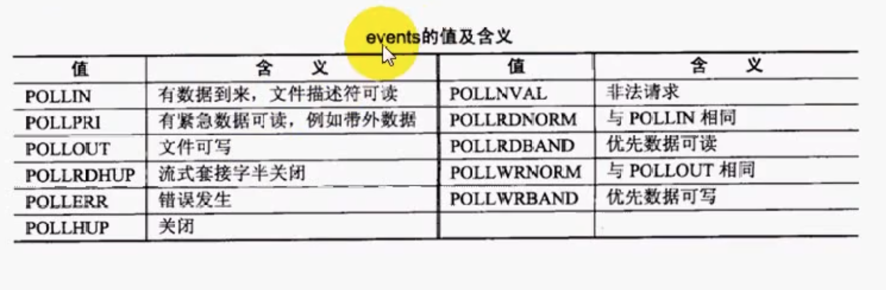

`select与poll`:
`select`的限制：
1. 一个进程可打开的最大文件描述个数有限；
2. `FD_SETSIZE`大小为`1024`。

`poll`的限制：
1. 一个进程可以打开的最大文件描述符，个数有限。

共同点：
1. 内核需要遍历所有的文件描述符，直到找到发生事件的文件描述符。

`epoll`相关函数：
```cpp
#include <sys/epoll.h>

int epoll_create(int __size);
int epoll_create1(int __flags);

int epoll_ctl(int __epfd, int __op, int __fd, struct epoll_event *__event);
int epoll_wait(int                 __epfd,
               struct epoll_event *__events,
               int                 __maxevents,
               int                 __timeout);
```
`epoll`与`poll、select`的区别：
1. 相比于`select、poll`, `epoll`的最大有点在于不会随着监听`fd`数目增加降低效率；
2. 内核中`select、poll`的实现采用轮询来处理，轮询的`fd`数目越多，耗时越多；
3. `epoll`基于回调实现的，如果有期待的`fd`事件发生就就通过回调函数将其加入到`epoll`就绪队列中，只关心活跃的`fd`,与`fd`的数目无关。
4. `内核\用户空间拷贝问题`，`poll,select`采用了内存拷贝的方法，`epoll`采用了共享内存的方式；
5. `epoll`不仅通知应用程序`I/O`事件的到来，还会通知应用程序相关的信息,这些信息是应用程序填充的，应用程序根据这些信息快速判断事件的类型。
```cpp
/**
 * @file epolldemo.cc
 * @author koritafei (koritafei@gmail.com)
 * @brief
 * @version 0.1
 * @date 2021-09-04
 *
 * @copyright Copyright (c) 2021
 *
 */

#include <arpa/inet.h>
#include <asm-generic/errno-base.h>
#include <asm-generic/socket.h>
#include <fcntl.h>
#include <netinet/in.h>
#include <sys/epoll.h>
#include <sys/socket.h>
#include <sys/stat.h>
#include <sys/types.h>
#include <sys/wait.h>
#include <unistd.h>

#include <algorithm>
#include <cerrno>
#include <csignal>
#include <cstddef>
#include <cstdio>
#include <cstdlib>
#include <cstring>
#include <vector>

typedef std::vector<struct epoll_event> EventList;

#define ERR_EXIT(m)                                                            \
  do {                                                                         \
    perror(m);                                                                 \
    exit(EXIT_FAILURE);                                                        \
  } while (0)

void active_nonblock(int fd) {
  int ret;
  int flags = fcntl(fd, F_GETFL);
  if (-1 == flags) {
    ERR_EXIT("fcntl error");
  }

  flags |= O_NONBLOCK;
  ret = fcntl(fd, F_SETFL, flags);

  if (-1 == ret) {
    ERR_EXIT("fcntl error");
  }
}

ssize_t readn(int fd, void *buf, size_t count) {
  size_t  nleft = count;
  ssize_t nread;
  char *  bufp = (char *)(buf);

  while (0 < nleft) {
    if (0 > (nread = read(fd, bufp, nleft))) {
      if (errno == EINTR) {
        continue;
      }
      return -1;
    } else if (nread == 0) {
      return count - nleft;
    }

    bufp += nread;
    nleft -= nread;
  }

  return count;
}

ssize_t writen(int fd, void *buf, size_t count) {
  size_t  nleft = count;
  ssize_t nwrite;
  char *  bufp = (char *)buf;
  while (0 < nleft) {
    if (0 > (nwrite = write(fd, bufp, nleft))) {
      if (errno == EINTR) {
        continue;
      }

      return -1;
    } else if (0 == nwrite) {
      return count - nleft;
    }

    bufp += nwrite;
    nleft -= nwrite;
  }

  return count;
}

ssize_t recv_peek(int sockfd, void *buf, size_t len) {
  for (;;) {
    int ret = recv(sockfd, buf, len, MSG_PEEK);
    if (ret == -1 && errno == EINTR) {
      continue;
    }
    return ret;
  }
}

ssize_t readline(int sockfd, void *buf, ssize_t maxline) {
  int   ret;
  int   nread;
  char *bufp  = (char *)buf;
  int   nleft = maxline;

  for (;;) {
    ret = recv_peek(sockfd, bufp, nleft);
    if (ret < 0) {
      return ret;
    } else if (0 == ret) {
      return ret;
    }

    nread = ret;
    // 查找\n
    for (int i = 0; i < nread; i++) {
      if (bufp[i] == '\n') {
        ret = readn(sockfd, bufp, i + 1);
        if (i + 1 != ret) {
          ERR_EXIT("readn error");
        }
        return ret;
      }
    }

    if (nread > nleft) {
      ERR_EXIT("recv error");
    }

    nleft -= nread;
    ret = readn(sockfd, bufp, nread);
    if (ret != nread) {
      ERR_EXIT("readn error");
    }

    bufp += nread;
  }

  return -1;
}

void signal_sigchld(int sig) {
  while (waitpid(-1, NULL, WNOHANG))
    ;
}

void signal_sigpipe(int sig) {
  printf("recv a sig = %d\n", sig);
}

int main(int argc, char **argv) {
  int ret;

  // 注册信号处理
  signal(SIGCHLD, signal_sigchld);
  signal(SIGPIPE, signal_sigpipe);

  int listenfd;
  // 开启socket
  if (0 > (listenfd = socket(PF_INET, SOCK_STREAM, IPPROTO_TCP))) {
    ERR_EXIT("socket error");
  }

  // bind
  struct sockaddr_in servaddr;
  memset(&servaddr, 0, sizeof(servaddr));
  servaddr.sin_family      = AF_INET;
  servaddr.sin_addr.s_addr = htonl(INADDR_ANY);
  servaddr.sin_port        = htons(8899);

  int on = 1;
  // 设置地址port 断开立刻可用
  if (0 > setsockopt(listenfd, SOL_SOCKET, SO_REUSEADDR, &on, sizeof(on))) {
    ERR_EXIT("setsockopt addr error");
  }

  if (0 > setsockopt(listenfd, SOL_SOCKET, SO_REUSEPORT, &on, sizeof(on))) {
    ERR_EXIT("setsockopt port error");
  }

  if (0 > bind(listenfd,
               reinterpret_cast<struct sockaddr *>(&servaddr),
               sizeof(struct sockaddr))) {
    ERR_EXIT("bind error");
  }

  // listen
  if (0 > listen(listenfd, SOMAXCONN)) {
    ERR_EXIT("listen error");
  }

  // epoll create
  std::vector<int> clients;
  int              epollfd = epoll_create1(EPOLL_CLOEXEC);

  struct epoll_event event;
  event.data.fd = listenfd;
  event.events  = EPOLLIN | EPOLLET;

  epoll_ctl(epollfd, EPOLL_CTL_ADD, listenfd, &event);

  EventList          events(16);
  struct sockaddr_in peeraddr;
  socklen_t          peerlen;
  int                conn;
  int                i;
  int                nready;
  for (;;) {
    nready = epoll_wait(epollfd,
                        &*events.begin(),
                        static_cast<int>(events.size()),
                        -1);

    if (-1 == nready) {
      if (EINTR == errno) {
        continue;
      }
      ERR_EXIT("epoll wait error");
    }
    if (0 == nready) {
      continue;
    }

    if ((size_t)nready == events.size()) {
      events.resize(events.size() * 2);
    }

    for (i = 0; i < nready; i++) {
      if (listenfd == events[i].data.fd) {
        peerlen = sizeof(peeraddr);

        // accept
        conn = accept(listenfd,
                      reinterpret_cast<struct sockaddr *>(&peeraddr),
                      &peerlen);
        if (-1 == conn) {
          ERR_EXIT("accept error");
        }

        printf("ip = %s, port = %d\n",
               inet_ntoa(peeraddr.sin_addr),
               ntohs(peeraddr.sin_port));
        clients.push_back(conn);
        active_nonblock(conn);

        event.data.fd = conn;
        event.events  = EPOLLIN | EPOLLET;
        epoll_ctl(epollfd, EPOLL_CTL_ADD, conn, &event);
      } else if (events[i].events & EPOLLIN) {
        conn = events[i].data.fd;
        if (0 > conn) {
          continue;
        }

        char recvbuf[1024] = {0};
        int  ret           = readline(conn, recvbuf, 1024);

        if (-1 == ret) {
          ERR_EXIT("readline error");
        }

        if (0 == ret) {
          printf("client close\n");
          close(conn);

          event = events[i];
          epoll_ctl(epollfd, EPOLL_CTL_DEL, conn, &event);

          clients.erase(std::remove(clients.begin(), clients.end(), conn),
                        clients.end());
        }

        fputs(recvbuf, stdout);
        write(conn, recvbuf, strlen(recvbuf));
      }
    }
  }

  return 0;
}
```
#### `epoll`模式
1. `EPOLLLT`电平模式
   完全依靠`kernel epoll`驱动，应用程序只需要处理从`epoll_wait`返回的`fds`，这些`fds`处于就绪状态。
2. `EPOLLET`边沿模式
   系统仅通知应用程序哪些`fd`就绪，一旦`fd`变为就绪状态，`epoll`不再关注这个`fd`的任何信息，(从`epoll`队列中移除)，直到应用程序读写操作出发了`EAGAIN`状态，`epoll`认为这个`fd`状态又变为空闲状态, 重新关注该`fd`变化。
   随着`epoll_wait`的返回，队列中的`fd`是逐渐减少，所以在大并发的系统中更具有优势。

### `UDP`
`UDP`特点：
1. 无连接；
2. 基于消息的数据传输服务；
3. 不可靠；
4. 一般情况下`UDP`更加高效。

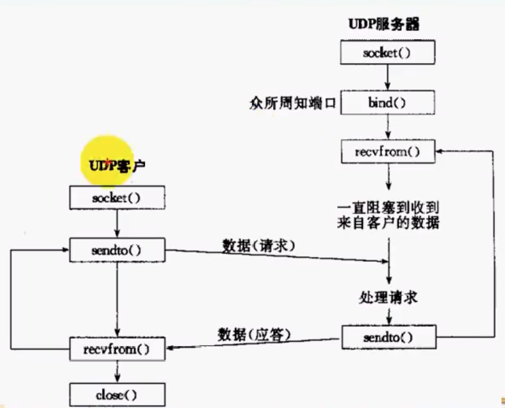

`UDP`注意点：
1. `UDP`报文可能会丢失，重复；
2. `UDP`报文可能会乱序；
3. `UDP`缺乏流量控制；
4. `UDP`协议数据报文截断；
5. `recvfrom`返回0， 不代表连接关闭，`udp`是无连接的；
6. `ICMP`异步错误；
7. `UDP contect`;
8. `UDP` 外出接口的确定。

```cpp
/**
 * @file udpserver.cc
 * @author koritafei (koritafei@gmail.com)
 * @brief
 * @version 0.1
 * @date 2021-09-05
 *
 * @copyright Copyright (c) 2021
 *
 */

#include <arpa/inet.h>
#include <errno.h>
#include <netinet/in.h>
#include <stdio.h>
#include <stdlib.h>
#include <string.h>
#include <sys/socket.h>
#include <sys/stat.h>
#include <sys/types.h>
#include <unistd.h>

#define ERR_EXIT(m)                                                            \
  do {                                                                         \
    perror(m);                                                                 \
    exit(EXIT_FAILURE);                                                        \
  } while (0)

void echo_svr(int sock);

int main(int argc, char **argv) {
  int sock;

  if (0 > (sock = socket(PF_INET, SOCK_DGRAM, 0))) {
    ERR_EXIT("udp sock error");
  }

  struct sockaddr_in servaddr;
  memset(&servaddr, 0, sizeof(servaddr));
  servaddr.sin_family      = AF_INET;
  servaddr.sin_port        = htons(8899);
  servaddr.sin_addr.s_addr = htonl(INADDR_ANY);

  if (0 > bind(sock,
               reinterpret_cast<struct sockaddr *>(&servaddr),
               sizeof(servaddr))) {
    ERR_EXIT("bind error");
  }

  echo_svr(sock);

  return 0;
}

void echo_svr(int sock) {
  char recvbuf[1024] = {0};

  struct sockaddr_in peeraddr;
  socklen_t          peerlen;
  int                n;

  for (;;) {
    peerlen = sizeof(peeraddr);
    memset(recvbuf, 0, sizeof(recvbuf));

    n = recvfrom(sock,
                 recvbuf,
                 sizeof(recvbuf),
                 0,
                 reinterpret_cast<struct sockaddr *>(&peeraddr),
                 &peerlen);
    if (n == -1) {
      if (errno == EINTR) {
        continue;
      }
      ERR_EXIT("recvfrom");
    } else if (0 < n) {
      fputs(recvbuf, stdout);
      sendto(sock,
             recvbuf,
             n,
             0,
             reinterpret_cast<struct sockaddr *>(&peeraddr),
             peerlen);
    }
  }
  close(sock);
}


/**
 * @file udpclient.cc
 * @author koritafei (koritafei@gmail.com)
 * @brief
 * @version 0.1
 * @date 2021-09-05
 *
 * @copyright Copyright (c) 2021
 *
 */

#include <arpa/inet.h>
#include <errno.h>
#include <netinet/in.h>
#include <stdio.h>
#include <stdlib.h>
#include <string.h>
#include <sys/socket.h>
#include <sys/stat.h>
#include <sys/types.h>
#include <unistd.h>

#define ERR_EXIT(m)                                                            \
  do {                                                                         \
    perror(m);                                                                 \
    exit(EXIT_FAILURE);                                                        \
  } while (0)

void echo_cli(int sock);

int main(int argc, char **argv) {
  int sock;

  if (0 > (sock = socket(PF_INET, SOCK_DGRAM, 0))) {
    ERR_EXIT("udp sock error");
  }

  echo_cli(sock);

  return 0;
}

void echo_cli(int sock) {
  struct sockaddr_in servaddr;
  memset(&servaddr, 0, sizeof(servaddr));
  servaddr.sin_family      = AF_INET;
  servaddr.sin_port        = htons(8899);
  servaddr.sin_addr.s_addr = inet_addr("127.0.0.1");

  char sendbuf[1024] = {0};
  char recvbuf[1024] = {0};

  while (NULL != fgets(sendbuf, sizeof(sendbuf), stdin)) {
    sendto(sock,
           sendbuf,
           sizeof(sendbuf),
           0,
           reinterpret_cast<struct sockaddr *>(&servaddr),
           sizeof(servaddr));
    recvfrom(sock, recvbuf, sizeof(recvbuf), 0, NULL, NULL);
    fputs(recvbuf, stdout);
    memset(sendbuf, 0, sizeof(sendbuf));
    memset(recvbuf, 0, sizeof(recvbuf));
  }
}
```
### `UNIX`域
```cpp
#define UNIX_PATH_MAX 108

struct sockaddr_un{
  sa_family_t sun_family;
  char sun_path[UNIX_PATH_MAX];
};

```
### `sockpair`
```cpp
#include <sys/socket.h>
#include <sys/types.h>

/**
 * @brief 创建一个全双工流管道
 *
 * @param __domain 协议家族
 * @param __type 套接字类型
 * @param __protocol 协议类型
 * @param __fds 返回套接字对
 * @return int 成功返货0， 失败返回-1
 */
int socketpair(int __domain, int __type, int __protocol, int *__fds);

ssize_t sendmsg(int sockfd, const struct msghdr *msg, int flags);

struct msghdr {
               void         *msg_name;       // 接收方地址
               socklen_t     msg_namelen;    // 接收方地址长度
               struct iovec *msg_iov;       // 发送数据地址
               size_t        msg_iovlen;     // 发送数据个数
               void         *msg_control;    /* ancillary data, see below */
               size_t        msg_controllen; /* ancillary data buffer len */
               int           msg_flags;      /* flags (unused) */ };
};
```
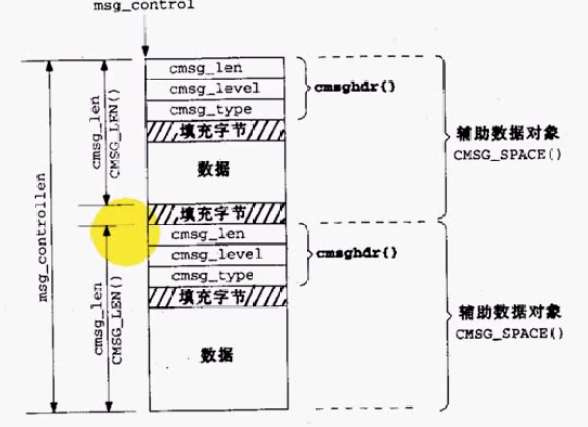
### 进程间通信
进程通信的目的：
1. 数据传输： 一个进程需要将它的数据发送给另外的进程；
2. 资源共享： 多个进程间共享同样的资源；
3. 通知事件：一个进程需要向另一个进程或一组进程发送消息，通知他们发生了某种事件；
4. 进程控制：有些进程希望控制另外进程的执行，此时控制进程希望能够拦截另一个进程的所有陷入和异常，并及时知道其状态改变。

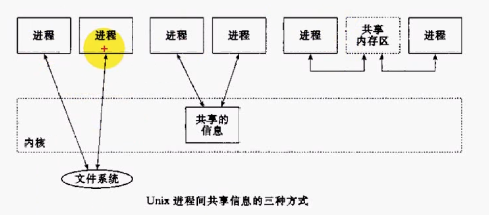
`IPC`对象的持续性：
1. 随进程持续：一直存在直到打开的最后一个进程结束；
2. 随内核持续：一直存在到内核自举或显时删除；
3. 随文件系统持续：一直持续到显时删除，及时内核自举存在。
  
死锁产生的必要条件：
1. 互斥条件
  进程资源排他性使用；
2. 请求和保持条件
  当进程因请求其他资源而阻塞时，不释放已获得资源；
3. 不可剥夺条件
   进程已获得的资源在未使用完之前，不能被剥夺，只能自己释放
4. 环路等待条件
   各个进程组成封闭的环形链条，每个进程都等待下一个进程锁占用的资源。

#### 消息队列
1. 提供了一个进程到另一个进程发送一块数据的方法；
2. 每个数据块都认为是有类型的，接收者的进程接收的数据可以有不同的类型值；
3. 消息队列和管道一样有着不足，每个消息的最大长度有上限。

```cpp
#include <sys/ipc.h>
#include <sys/msg.h>
#include <sys/types.h>

/**
 * @brief 创建和访问一个消息队列
 *
 * @param __key 某个消息队列的名字
 * @param __msgflg 有9个权限标志构成，用法与创建文件时使用的标志位相同
 * @return int 成功返回一个非负整数，即该消息队列的标识，失败返回-1
 */
int msgget(key_t __key, int __msgflg);
```
查看消息队列命令：`ipcs`; 删除消息队列命令： `ipcrm -q xxx`。
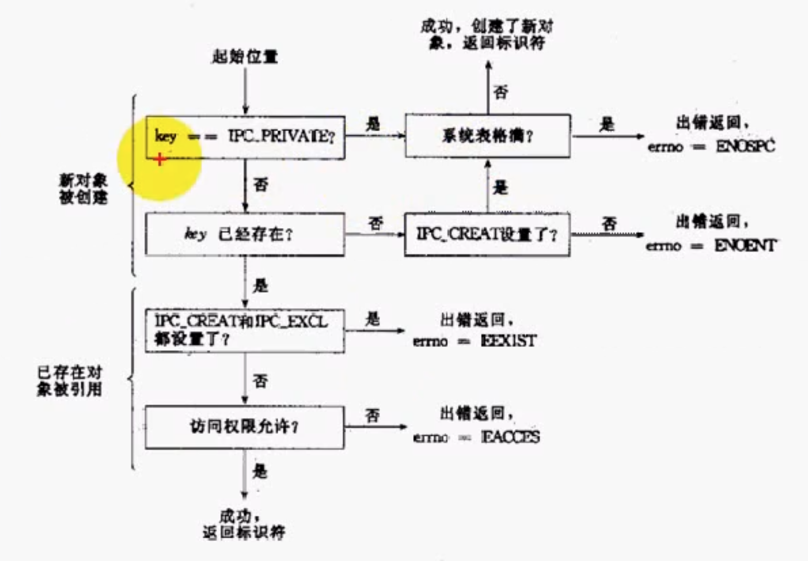
```cpp
#include <sys/ipc.h>
#include <sys/msg.h>
#include <sys/socket.h>

/**
 * @brief 将一条信息添加到消息队列中
 *
 * @param __msqid 由msgget函数返回的消息队列编码
 * @param __msgp 指针指向准备发送的消息
 * @param __msgsz 消息长度
 * @param __msgflg 标识，控制着消息队列满或达到消息队列上限时要发生的事
 * @return int 成功返回0，失败返回-1
 */
int msgsnd(int __msqid, const void *__msgp, size_t __msgsz, int __msgflg);

/**
 * @brief 从消息队列获取一个消息
 *
 * @param __msqid 消息队列标识码
 * @param __msgp 指针，指向准备接收的消息
 * @param __msgsz 消息长度，不含long int 消息类型
 * @param __msgtyp 指定接收优先级的简单形式
 * @param __msgflg 控制队列中没有数据的梳理
 * @return int 成功返回放到缓存中的字符数，失败返回-1
 */
int msgrcv(int    __msqid,
           void*  __msgp,
           size_t __msgsz,
           long   __msgtyp,
           int    __msgflg);
```
当`__msgflg=IPC_NOWAIT`队列满时不等待，直接返回`EAGAIN`错误；
消息结构受到两方面的制约：
1. 必须小于系统规定的上限值；
2. 必须以一个`long int`的长整数开始，接收者函数将利用这个长整型参数，确定消息类型。

```cpp
struct msgbuf{
  long mtype;
  char mtext[1];
};
```

`msgtype`值定义描述：

|  值   |                       含义                        |
| :---: | :-----------------------------------------------: |
| `==0` |               返回队列的第一条信息                |
| `>0`  |      返回队列中第一条类型等于`msgtype`的信息      |
| `<0`  | 返回队列中第一条类型小于等于`msgtype`绝对值的信息 |

`msgflg`定于与描述：

|      值       |                 含义                 |
| :-----------: | :----------------------------------: |
| `IPC_NOWAIT`  | 队列中没有可读消息，返回`ENOMSG`错误 |
| `MSG_NOERROR` |      消息大小超过`msgsiz`被截断      |
`msgtype>0`且`msgflg=MSG_EXCEPT`接收类型不等于`msgtype`的第一条信息。

### 共享内存
最快的`IPC`方式，共享内存映射到进程的地址空间，数据传递无需经过内核。
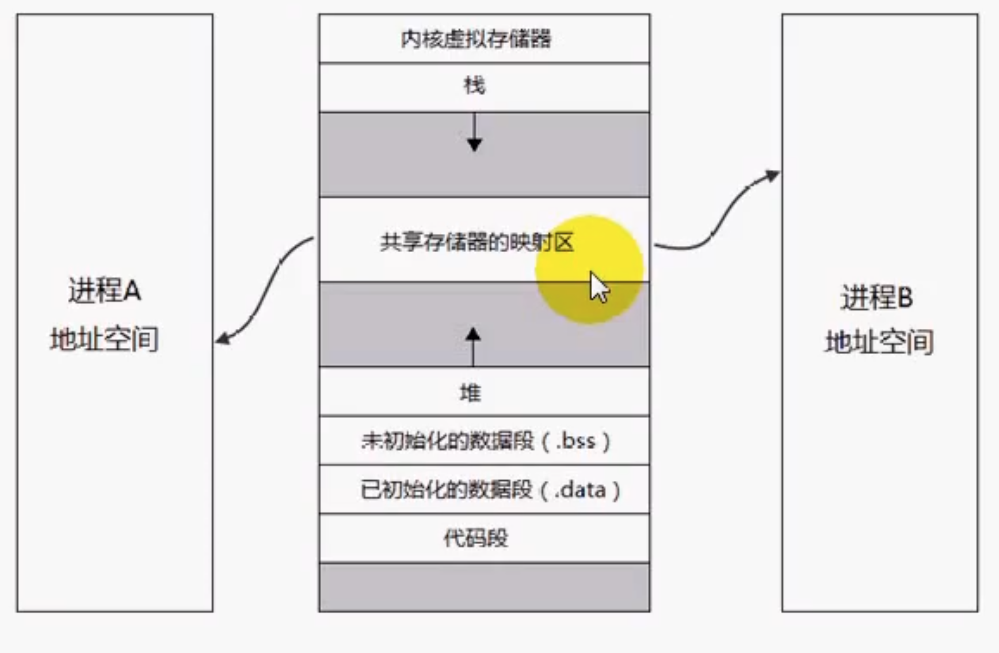
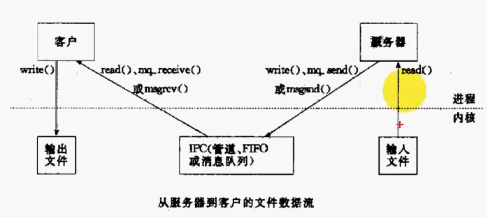
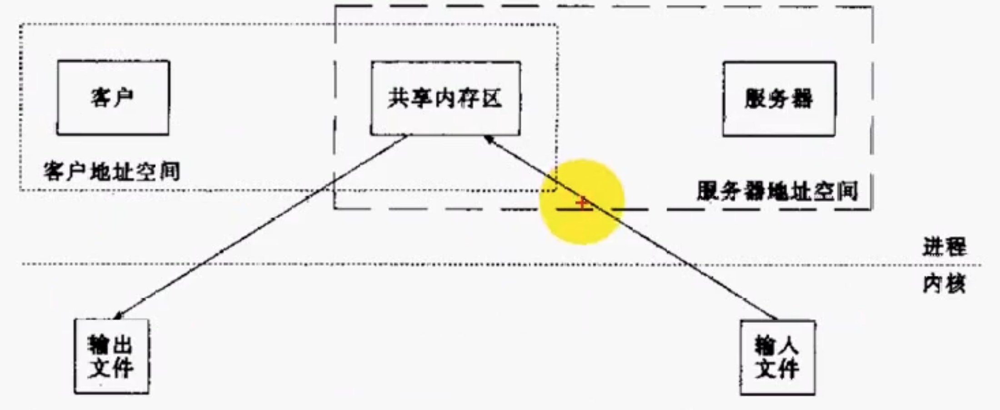
```cpp
#include <sys/mman.h>

/**
 * @brief 将文件或设备映射到共享内存区
 *
 * @param addr 要映射的起始地址，通常指定为NULL，让内核自动选择
 * @param length 映射到进程地址空间的字节数
 * @param prot 映射区保护方式
 * @param flags 标志
 * @param fd 文件描述符
 * @param offset 从文件头开始的偏移量
 * @return void* 成功返回映射到内存区的起始地址，失败返回-1
 */
void *mmap(void * addr,
           size_t length,
           int    prot,
           int    flags,
           int    fd,
           off_t  offset);
```
`prot`参数定义：

|     定义     |     描述     |
| :----------: | :----------: |
| `PROT_READ`  |   页面可读   |
| `PORT_WRITE` |   页面可写   |
| `PROC_EXEC`  |  页面可执行  |
| `PROT_NONE`  | 页面不可访问 |

`flag`定义与说明：
|      定义       |            描述            |
| :-------------: | :------------------------: |
|  `MAP_SHARED`   |         变动可共享         |
|  `MAP_PRIVATE`  |          变动私有          |
|   `MAP_FIXED`   |     准确解释`addr`含义     |
| `MAP_ANONYMOUS` | 建立匿名映射区，不涉及文件 |
 
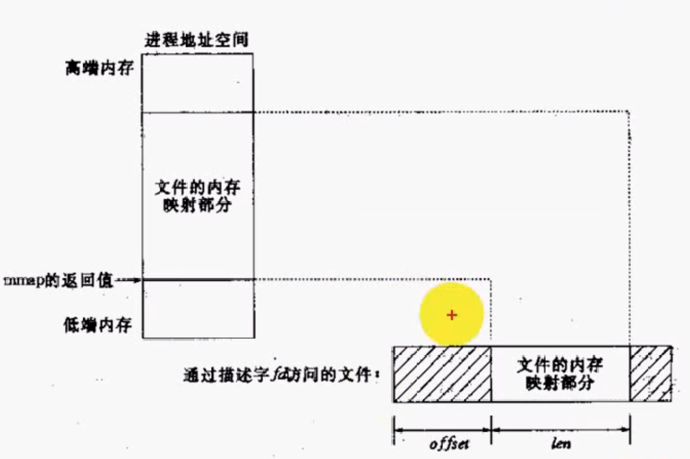
```cpp
/**
 * @brief 取消mmap函数建立的映射
 *
 * @param __addr 映射的内存起始地址
 * @param __len 映射到进程地址空间的字节数
 * @return int 成功返回0， 失败返回-1
 */
int munmap(void *__addr, size_t __len);

/**
 * @brief 对映射的共享内存执行同步操作
 *
 * @param __addr 内存起始地址
 * @param __len 长度
 * @param __flags 选项
 * @return int 成功返回0， 失败返回-1
 */
int msync(void *__addr, size_t __len, int __flags);
```

`msync`的`__flags`定义：
|      定义       |         描述         |
| :-------------: | :------------------: |
|   `MS_ASYNC`    |      执行异步写      |
|    `MS_SYNC`    |      执行同步写      |
| `MS_INVALIDATE` | 使高速缓存的数据失效 |

`map`注意点：
1. 映射不能改变文件大小；
2. 可用于进程间通信的有效地址空间不完全受限于被映射文件大小；
3. 文件一旦被映射，所有对映射区域的实际访问实际上是对内存的访问，映射区域内容写回文件时，所写内容不能超过文件大小。

共享内存数据结构：
```cpp
  struct shmid_ds {
               struct ipc_perm shm_perm;    /* Ownership and permissions */
               size_t          shm_segsz;   /* Size of segment (bytes) */
               time_t          shm_atime;   /* Last attach time */
               time_t          shm_dtime;   /* Last detach time */
               time_t          shm_ctime;   /* Last change time */
               pid_t           shm_cpid;    /* PID of creator */
               pid_t            shm_lpid;     /* PID of last shmat(2)/shmdt(2)
           */
               shmatt_t        shm_nattch;  /* No. of current attaches */
               ...  };
```
`shmget`函数：
```cpp
#include <sys/ipc.h>
#include <sys/msg.h>
#include <sys/shm.h>

/**
 * @brief 创建共享内存
 *
 * @param __key 共享内存名称
 * @param __size 共享内存大小
 * @param __shmflg 权限标志位
 * @return int 成功返回一个非负数，即该共享内存段标识码，失败返回-1
 */
int shmget(key_t __key, size_t __size, int __shmflg);
```
```cpp
/**
 * @file shmgetdemo.cc
 * @author koritafei (koritafei@gmail.com)
 * @brief
 * @version 0.1
 * @date 2021-09-06
 *
 * @copyright Copyright (c) 2021
 *
 */

#include <errno.h>
#include <fcntl.h>
#include <stdio.h>
#include <stdlib.h>
#include <string.h>
#include <sys/mman.h>
#include <sys/shm.h>
#include <sys/stat.h>
#include <sys/types.h>
#include <unistd.h>

#define ERR_EXIT(m)                                                            \
  do {                                                                         \
    perror(m);                                                                 \
    exit(EXIT_FAILURE);                                                        \
  } while (0)

typedef struct stu {
  char name[32];
  int  age;
} STU;

int main(int argc, char **argv) {
  int shmid;
  shmid = shmget(1234, sizeof(STU), IPC_CREAT | 0666);
  if (-1 == shmid) {
    ERR_EXIT("shmget");
  }

  return 0;
}
```
`shmat`函数：
```cpp
/**
 * @brief 将共享内存段连接到进程地址空间
 *
 * @param shmid 共享内存标识
 * @param shmaddr 指定连接地址
 * @param schmflg `SHM_RND`或`SHM_RDONLY`
 * @return void* 成功返回一个指针，指向共享内存的第一节，失败返回-1
 */
void *shmat(int shmid, const void *shmaddr, int schmflg);
```
`shmaddr`为`NULL`, 核心自动选择一个地址；
`shmaddr`不为`NULL`且`shmflg`无`SHM_RND`标记，则`shmaddr`为连接地址；
`shmaddr`不为`NULL`且`shmflg`为`SHM_RND`标记，则连接地址自动向下调整为`SHMLBA`的整数倍，
公式为: $shmaddr-(shmaddr\%SHMLBA)$
`shmflg=SHM_RDONLY`，表示连接操作用来只读内存。
```cpp
/**
 * @brief 将共享内存段与当前进程脱离
 *
 * @param __shmaddr 有shmat所返回的指针
 * @return int 成功返回0，失败返回-1
 */
int shmdt(const void *__shmaddr);
```
**将共享内存与进程脱离不等于删除共享内存段。**
```cpp
/**
 * @brief 用来创建和访问一个消息队列
 *
 * @param shmid shmget返回的共享内存标识码
 * @param cmd 将采取的动作
 * @param buf 保存共享内存的模式状态和访问权限的数据结构
 * @return int 成功返回0， 失败返回-1
 */
int schmctl(int shmid, int cmd, struct shmid_ds *buf);
```
### 信号量
信号量数据结构：
```cpp
struct semaphore{
  int value;
  pointer_PCB queue;
};
```
信号量集的数据结构：
```cpp
struct semid_ds{
  struct ipc_perm sem_perm;
  time_t sem_otime;
  time_t sem_ctime;
  unsigned short sem_nsems; // 信号量个数
};
```
`semget`函数：
```cpp
#include <sys/ipc.h>
#include <sys/sem.h>
#include <sys/types.h>

/**
 * @brief 用来创建和访问一个信号集
 *
 * @param key 信号集名称
 * @param nsems 信号量个数
 * @param semflg 权限位
 * @return int 成功返回信号集标识码，失败返回-1
 */
int semget(key_t key, int nsems, int semflg);
```
`semctl`函数：
```cpp

/**
 * @brief 控制信号量集
 *
 * @param __semid 信号量集标识
 * @param __semnum 信号量集中的信号量序号
 * @param __cmd 将要采取的动作
 * @param ... 命令不同而不同
 * @return int 成功返回0，失败返回-1
 */
int semctl(int __semid, int __semnum, int __cmd, ...);
```
### `posix`消息队列


